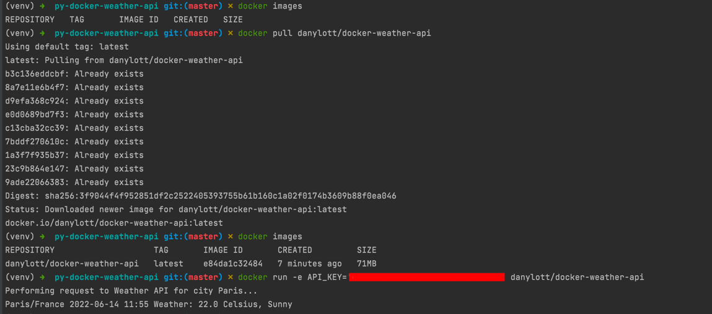

# Docker Weather API

- **Read** [the guideline](https://github.com/mate-academy/py-task-guideline/blob/main/README.md) before start
- Look through [Weather API](https://www.weatherapi.com/docs/) documentation, you will need it in this task

## Task

In this task you will be implementing the service for getting current weather
for Paris city. But the most interesting part, that this service must be dockerized
and pushed to the dockerhub. Use [Weather API](https://www.weatherapi.com/docs/) for getting
data about the weather.

The result of this task will be tested by the next commands:

Of course, instead of `danylott` - it must be your docker id.

So in this task requirements are next:
- The script for getting & printing weather info must be located at `app/main.py`;
- This service must be Dockerized using only `Dockerfile` (`docker-compose.yml` here is forbidden);
- The image of the service should be as thin as possible;
- Use `.dockerignore` file to avoid adding unnecessary stuff to docker image;
- You must use `requests` module for interacting with Weather API;
- You must publish your image to Docker Hub and check it is available for the world;
- You need to generate `API_KEY` for using Weather API, but it shouldn't be hard-coded in `main.py`. 

  You should use environment variables for that purpose. So, read `API_KEY` from environment. 
  And to pass environment variables to docker container use `-e` flag.
- Don't forget to add `.dockerignore` file to your PR;
- You must *modify* this line with correct command to pull your image:
  COMMAND=`docker pull oleksandrsemenenko/docker-weather-api`.

<details>
  <summary><strong>Hint</strong></summary>
    Don't use `< >` in docker command. Here is the example:

```docker pull test_user/weather```
</details>

### Note: Check your code using this [checklist](checklist.md) before pushing your solution.